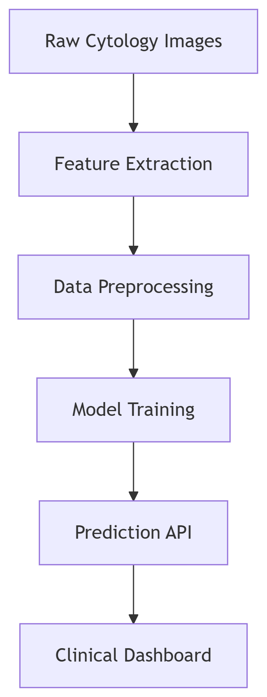

# Breast Cancer Classification 🎗️

A machine learning project to classify breast cancer tumors as **malignant** or **benign** using various ML algorithms.

## 📌 Overview
This project implements different machine learning models to predict breast cancer based on the Wisconsin Breast Cancer Dataset. The goal is to compare the performance of various classification algorithms in detecting breast cancer from tumor characteristics.

## 🚀 Features
- Data preprocessing (handling missing values, feature scaling)

- Exploratory Data Analysis (EDA) with visualizations

- Multiple ML models implemented:

- Logistic Regression

- K-Nearest Neighbors (KNN)

- Support Vector Machine (SVM)

- Random Forest

- XGBoost

- Model evaluation (accuracy, precision, recall, F1-score, ROC curves)

- Feature importance analysis

## 📊 Dataset
The dataset contains 569 samples with 32 features (ID, diagnosis, and 30 real-valued features computed from digitized images of cell nuclei).

Features include:

- Radius

- Texture

- Perimeter

- Area

- Smoothness

- Compactness

- Concavity

- Symmetry

- Fractal dimension

(For each feature, mean, standard error, and worst values are calculated)

## 🧠 How It Works
### 🔍 Data Flow Pipeline

 
